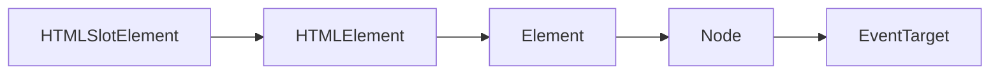

[https://www.notion.so/Web-Components-97c73d287ed84ce0896fb9f5665037dd](https://www.notion.so/Web-Components-97c73d287ed84ce0896fb9f5665037dd)


## **HTMLSlotElement**


The **`HTMLSlotElement`** interface of the [Shadow DOM API](https://developer.mozilla.org/en-US/docs/Web/API/Web_components/Using_shadow_DOM) enables access to the name and assigned nodes of an HTML [`<slot>`](https://developer.mozilla.org/en-US/docs/Web/HTML/Element/slot) element.





## Life Cycle Callbacks


Special callback functions defined inside the custom element's class definition, which affect its behavior:


**connectedcallback**


Invoked when the custom element is first connected to the document's DOM.


**disconnectedcallback**


Invoked when the custom element is disconnected from the document's DOM.


**adoptedcallback**


Invoked when the custom element is moved to a new document.


**attributechangedcallback**


Invoked when one of the custom element's attributes is added, removed, or changed.


## CSS pseudo-classes


```scss
:defined {}
:host {}
:host() {}
:host-context() {}
```


## Access parent element


```javascript
<wc-parent>
	<wc-child>
	  <wc-subchild>
	  </wc-subchild>
	</wc-child>
<wc-parent>
```


```javascript
function findParent(startElement: Element | ShadowRoot, selector: string): Element | null {
  let result: Element | null;
  if (startElement instanceof HTMLElement) {
    result = startElement.closest(selector);
    if (result) {
      return result;
    }
  }
  const r = startElement.getRootNode();
  if (r instanceof ShadowRoot) {
    return findParent((r as ShadowRoot).host, selector);
  }
  return null;
}

// wc-subchild component
findParent(this.shadowRoot, 'wc-parent');
```

