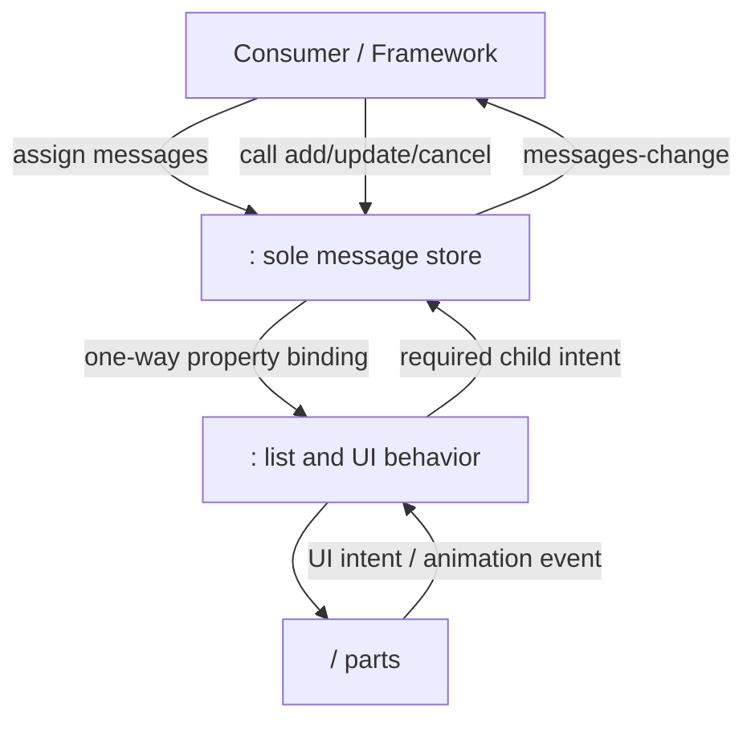
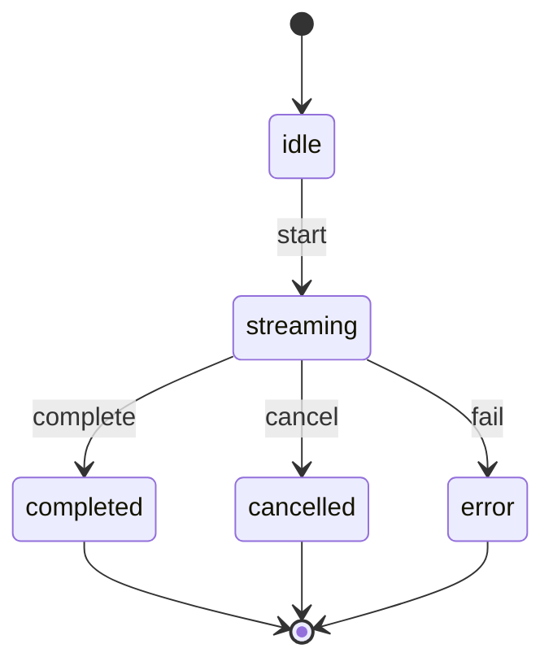

# `<i-chat>` Single-Source Message State Refactor Plan

> This document is an implementation runbook for future AI agents and developers. Execute the Changes in order. Do not combine work from different Changes unless a Change explicitly permits it.

## 1. Document Status

| Item | Value |
|------|-------|
| Document status | **Planned, implementation in progress** |
| Implementation progress | **4 / 9** |
| Current code baseline | monorepo `2.0.0` |
| Last verified | 2026-07-21 |
| Core approach | `<i-chat>` is the sole message-state owner in composed usage; `<i-chat-messages>` retains standalone state capabilities |
| Compatibility policy | 2.x only adds APIs, migrates internals, and fixes defects; public API removal is reserved for the next major version |

### Status Values

- `NOT STARTED`: Implementation has not begun.
- `IN PROGRESS`: Work has begun, but not all acceptance criteria have been met.
- `BLOCKED`: An external decision or technical blocker prevents completion. Record the reason in the implementation notes.
- `DONE`: Implementation, tests, documentation, and build validation have all passed.
- `DEFERRED`: Intentionally postponed and excluded from the current release scope.

### Breaking-Change Classification

- `No`: Does not remove or change a documented public type, method, property, event signature, or default behavior. Existing valid integrations require no migration.
- `No (bug fix)`: Corrects behavior that conflicts with the public contract. Code that accidentally depends on the defect may observe a change, but this is not considered a semver breaking change.
- `Potential`: The default behavior remains compatible, but an opt-in mode or edge-case behavior needs migration guidance.
- `Yes`: Can break compilation or change a documented default for valid existing integrations. This requires a new major version.

## 2. Background and Problem Statement

`<i-chat>` currently has two message states that can diverge:

1. The public `Chat.messages` property in `packages/chat/src/components/chat.ts`.
2. The internal `<i-chat-messages>.messages` property in `packages/chat-messages/src/components/chat-messages.ts`.

Top-level methods such as `addMessage()`, `updateMessage()`, `appendPart()`, and `removeMessage()` currently delegate directly to the inner `<i-chat-messages>` element. Those calls update the inner array but do not update the public `chat.messages` array. As a result, the following sequence can overwrite messages that have already arrived through imperative or streaming updates:

```ts
chat.addMessage(incomingMessage);

// In the current implementation, chat.messages may still be the old array.
chat.messages = [...chat.messages, anotherMessage];
```

Most proxy methods also depend on `this._messages`, so they can throw when called before `<i-chat>` completes its first render. In addition, `createStreamingController()` returns a low-level typewriter animation controller. It has no understanding of message, part, run, complete, cancel, or error semantics.

### Current Hotspots

| Location | Current responsibility or issue |
|----------|---------------------------------|
| `packages/chat/src/components/chat.ts`: `messages` property | Publicly readable but not the authoritative state for every write path |
| `packages/chat/src/components/chat.ts`: message proxy methods | Mutate the inner component and are unsafe before first render |
| `packages/chat/src/components/chat.ts`: `firstUpdated()` / `updated()` | Push top-level properties downward but cannot synchronize internal mutations upward |
| `packages/chat/src/components/chat.ts`: `createStreamingController()` | Exposes an animation controller instead of a chat-run controller |
| `packages/chat-messages/src/components/chat-messages.ts`: mutation methods | Mix message collection updates, list UI state, and some DOM side effects |
| `packages/chat-messages/src/components/chat-messages.ts`: `cancelMessage()` | Couples data mutation, hint insertion, animation control, and DOM lookup |
| `packages/chat-messages/src/controllers/streaming-controller.ts` | Appropriate for internal typewriter animation, but not as a top-level run API |

## 3. Refactor Goals

### 3.1 Required Outcomes

1. When using `<i-chat>`, `chat.messages` is the only authoritative and immediately readable message state.
2. After any top-level message mutation returns, the next operation uses the latest array and cannot lose previously streamed data.
3. Every internal message mutation can be observed through one consistent `messages-change` event.
4. Data-oriented public methods are safe before the first render.
5. Standalone `<i-chat-messages>` retains its existing property and imperative method capabilities.
6. Message collection updates remain immutable: create new references only for the array and changed message/part/item, while preserving unchanged branches.
7. Streaming, cancellation, tool calls, todos, SSE updates, replies, error banners, scrolling, slots, and renderers must not regress.

### 3.2 Follow-up Enhancements

1. Add explicit controlled and uncontrolled message modes.
2. Add a real `ChatRunController` that understands a response-run lifecycle.
3. Deprecate, but retain, top-level `createStreamingController()` throughout 2.x. Consider removal only in a future major release.

### 3.3 Non-goals

This refactor does not:

- Own network requests, SSE connections, retries, authentication, or model SDK adapters.
- Move scroll state, error banners, reply blocks, expanded/collapsed state, confirmation queues, or composer drafts into `messages`.
- Change the `ChatMessage` or `MessagePart` model.
- Change renderer, slot, theme, or localization contracts.
- Remove standalone `<i-chat-messages>` mutation methods in 2.x.
- Rewrite the typewriter animation system before the core state migration is stable.

## 4. Target Architecture and Invariants



### 4.1 Composed Mode

When `<i-chat-messages>` is rendered inside `<i-chat>`:

- `<i-chat>.messages` owns message data.
- Every top-level message method calculates a next state and commits it to `<i-chat>.messages`.
- `<i-chat-messages>` receives the array through one-way property binding.
- Child elements retain presentation state and behavior that genuinely depends on the DOM.

### 4.2 Standalone Mode

When a consumer uses `<i-chat-messages>` directly:

- Its `messages` property remains its local state.
- Existing methods such as `addMessage()` and `updateMessage()` remain callable.
- Standalone and composed components use the same pure message reducers so their update semantics cannot drift.

### 4.3 Long-term Invariants

1. A top-level mutation updates `chat.messages` synchronously before the method returns. It must not require another frame or `updateComplete`.
2. Direct external assignment with `chat.messages = next` does not emit `messages-change`, preventing controlled-mode feedback loops.
3. Only component methods, child intents, or a run controller emit `messages-change` for internally requested changes.
4. Failed reducers and strict no-ops do not emit `messages-change`.
5. One logical mutation emits exactly one `messages-change` event.
6. `streaming-change` continues to mean “at least one message has `streaming && !error`.” It is not replaced by `messages-change`.
7. Cancel operations do not abort a network request. The consumer remains responsible for its `AbortController` or SDK request.
8. Scroll state, banners, reply blocks, and other presentation state stay out of the message store.

## 5. Public Event Contract

Change 1 introduces the following public types. The implementation may adjust the source-file location to fit existing conventions, but it must preserve these semantics.

```ts
export type MessagesChangeReason =
  | 'message:add'
  | 'message:update'
  | 'message:remove'
  | 'message:clear'
  | 'message:cancel'
  | 'message:error'
  | 'part:append'
  | 'part:update'
  | 'tool-call:update'
  | 'todo-item:update'
  | 'event:message-part-update'
  | 'event:todo-item-update';

export type MessagesChangeSource =
  | 'i-chat'
  | 'i-chat-messages'
  | 'chat-run-controller';

export interface MessagesChangeDetail {
  messages: ChatMessage[];
  previousMessages: ChatMessage[];
  reason: MessagesChangeReason;
  source: MessagesChangeSource;
  messageId?: string;
  partId?: string;
  itemId?: string;
  controlled?: boolean;
  committed?: boolean;
}
```

Event requirements:

- Name: `messages-change`.
- `bubbles: true`.
- `composed: true`.
- Not cancelable by default. Controlled behavior must be selected explicitly, not inferred from `preventDefault()` or listener presence.
- `previousMessages` is the pre-change reference; `messages` is the committed or proposed next reference.
- 2.x may add optional detail fields but must not remove fields or change their meaning.

## 6. Implementation Dashboard

| Change | Scope | Status | Dependency | Risk | Breaking |
|--------|-------|--------|------------|------|----------|
| CHG-01 | Add the `messages-change` contract and temporary reverse-sync bridge | `DONE` | None | Medium | No (bug fix) |
| CHG-02 | Extract shared pure message-collection reducers | `DONE` | CHG-01 | Low | No |
| CHG-03 | Move regular message mutations to the top-level store | `DONE` | CHG-02 | Medium | No (bug fix) |
| CHG-04 | Move diagnostic, tool, todo, and SSE updates to the top-level store | `DONE` | CHG-03 | Medium | No (bug fix) |
| CHG-05 | Separate cancellation data semantics from animation side effects | `NOT STARTED` | CHG-04 | High | No (bug fix) |
| CHG-06 | Add pre-render safety and a ready contract | `NOT STARTED` | CHG-05 | Medium | No |
| CHG-07 | Remove dependency on the temporary bridge and finish state convergence | `NOT STARTED` | CHG-06 | Medium | No (internal) |
| CHG-08 | Add explicit controlled and uncontrolled modes | `NOT STARTED` | CHG-07 | Medium | Potential; default remains compatible |
| CHG-09 | Add `ChatRunController` and deprecate the old top-level animation entry point | `NOT STARTED` | CHG-07; preferably after CHG-08 | Medium-high | No for addition/deprecation; removal is Yes and deferred to a major |

> The core state fix is complete at CHG-07. CHG-08 and CHG-09 may ship in later minor releases and must not block CHG-01 through CHG-07.

## 7. Detailed Change Plan

## CHG-01: Event Contract and Temporary Reverse-Sync Bridge

**Status: `NOT STARTED`**  
**Suggested release: 2.0.x patch**  
**Breaking: No (bug fix)**

### Goal

Before moving every method, make existing top-level proxy calls synchronize the newest inner array back to `chat.messages`. This immediately closes the silent data-loss path where a consumer reads a stale public array and overwrites streamed messages.

### Expected Impact

| Area | Impact |
|------|--------|
| `packages/chat-messages/src` | Add event types; route internal mutations through one commit helper that emits the event |
| `packages/chat/src/components/chat.ts` | Listen for child changes, synchronize the top-level property, and re-emit from `<i-chat>` |
| `packages/chat-messages/src/index.ts` | Export event detail, reason, and source types |
| `packages/chat/src/index.ts` | Re-export event types |
| `packages/chat-messages/test` | Add event count, detail, no-op, and failure tests |
| `packages/chat/test` or equivalent shell test location | Add top-level synchronization tests; establish a minimal test entry if needed |
| `docs/component-api.md` | Document the event |

### Tasks

- [ ] Add the public message-change event types in a dedicated file or an appropriate existing public type module.
- [ ] Add one private `ChatMessages._commitMessages(next, context)` entry point.
- [ ] `_commitMessages` must capture `previousMessages`, synchronously assign `this.messages = next`, and then emit exactly one event.
- [ ] If `next === this.messages`, do not commit and do not emit.
- [ ] Route existing `ChatMessages` data mutations through `_commitMessages` without changing their algorithms in this Change.
- [ ] Direct external assignment to `<i-chat-messages>.messages` must not emit the event.
- [ ] Listen for child `messages-change` in the `Chat` template.
- [ ] The parent handler must call `stopPropagation()`, synchronously assign `this.messages = detail.messages`, then emit one new event from `<i-chat>`.
- [ ] Before any still-delegated top-level mutation calls the child, synchronously set the child to the current `this.messages` reference. This prevents an external assignment followed immediately by a proxy call from using a stale child array before Lit has rendered.
- [ ] Before parent adoption, require `detail.previousMessages === this.messages`. If not, reject the stale child mutation and push the current top-level array back down.
- [ ] Preserve the original `reason`, identifiers, and `source` in the forwarded detail. The observable event target must be `<i-chat>`.
- [ ] Ensure that `updated()` pushing the same reference down cannot cause a second event.
- [ ] Add `@fires messages-change` JSDoc.
- [ ] Test that `chat.addMessage(a)` makes `chat.messages` contain `a` immediately.
- [ ] Test that assigning `[...chat.messages, b]` after `addMessage(a)` preserves both `a` and `b`.
- [ ] Test external assignment immediately followed by a delegated mutation without awaiting a Lit update. The mutation must use the new top-level array as its base.

### Acceptance Criteria

- After each delegated mutation, `chat.messages === inner.messages`.
- A listener on `<i-chat>` observes exactly one `messages-change` per logical mutation.
- Direct external assignment to `chat.messages` does not emit `messages-change`.
- A stale child event cannot overwrite a newer top-level array.
- Failed `try*` methods do not emit.
- Standalone `<i-chat-messages>` usage remains compatible.
- `npm test` and `npm run build` pass.

### Compatibility Notes

- **Expected change:** `chat.messages` no longer remains stale after a top-level method call.
- **Possible impact:** Code that intentionally depends on stale state will observe different behavior. That behavior was a defect, not a supported contract.
- **Unaffected:** Method names, parameters, return types, tag names, slots, renderers, and the message model.

### Rollback Boundary

The parent bridge and child `_commitMessages` conversion may be reverted together. Do not revert only the parent handler while leaving the child event semantics in place, because that would restore divergence and split the test contract.

---

## CHG-02: Extract Shared Pure Message-Collection Reducers

**Status: `NOT STARTED`**  
**Suggested release: 2.0.x patch**  
**Breaking: No**

### Goal

Move message-array operations that do not depend on the DOM out of `ChatMessages`, allowing `<i-chat>` and standalone `<i-chat-messages>` to share one immutable update implementation.

### Expected Impact

| Area | Impact |
|------|--------|
| `packages/chat-messages/src/message-collection-state.ts` (suggested new file) | Add pure reducers/helpers |
| `packages/chat-messages/src/message-part-state.ts` | Reuse existing part helpers; do not duplicate them |
| `packages/chat-messages/src/components/chat-messages.ts` | Use pure helpers plus `_commitMessages` |
| `packages/chat-messages/src/index.ts` | Export helpers and types required by `@bndynet/ichat` |
| `packages/chat-messages/test/message-body-baseline.test.ts` or a new test file | Add pure-function unit tests |

### Minimum Reducer Capabilities

- [ ] Add a message.
- [ ] Shallow-patch a message by id.
- [ ] Remove a message.
- [ ] Clear all messages.
- [ ] Append a part using `appendMessagePart()`.
- [ ] Update a part using `patchMessagePart()` / `applyMessagePartUpdate()`.
- [ ] Update a tool call using `findMessagePart()`, `patchToolCallPart()`, and `replaceMessagePart()`.
- [ ] Update a todo item using `patchTodoItem()` and `replaceMessagePart()`.
- [ ] Apply normalized message-part and todo SSE updates.
- [ ] Produce cancelled message data, including an optional hint, `streaming: false`, and `cancelled: true`. Leave animation effects to CHG-05.

### Pure-Function Requirements

- Do not access `HTMLElement`, shadow DOM, timers, `requestAnimationFrame`, or Lit lifecycle state.
- Do not dispatch events.
- Never mutate input arrays or objects in place.
- Return the original array reference when a target is missing or validation fails.
- Preserve existing diagnostic `ok`, `reason`, `part`, and normalized `update` results.
- Do not introduce a duplicate-message-id policy in this refactor; preserve current append behavior.
- Keep random id and timestamp generation for `addErrorMessage()` in the caller. Reducers receive an already constructed message.

### Test Matrix

- [ ] Add: preserve existing element references and append the new item.
- [ ] Update: replace only the target message.
- [ ] Missing update id: preserve the original array reference.
- [ ] Remove: target exists and target is missing.
- [ ] Clear: non-empty and already empty arrays.
- [ ] Part: append, patch, type mismatch, missing message, and missing part.
- [ ] Tool call: valid and invalid state transitions.
- [ ] Todo: monotonic revisions, stale revision, and invalid status.
- [ ] SSE: valid envelope, incorrect type, invalid JSON, and missing fields.
- [ ] Cancel: with/without hint, with/without text part, missing message, and repeated cancellation.

### Acceptance Criteria

- Existing `ChatMessages` public methods retain the same successful results and diagnostic reasons.
- Reducer tests require no custom element or DOM shim.
- Unchanged paths do not cause array identity churn.
- `npm test` and `npm run build` pass.

### Compatibility Notes

- Public method signatures do not change.
- Missing targets change from producing an equivalent new array to preserving the original reference. This removes unnecessary renders and is an internal optimization.
- Any newly exported helper is additive API, not a breaking change.

### Rollback Boundary

This Change may be rolled back to component-local algorithms, but CHG-01 event and commit semantics must remain intact.

---

## CHG-03: Move Regular Message Mutations to the Top-Level Store

**Status: `NOT STARTED`**  
**Suggested release: 2.0.x patch**  
**Breaking: No (bug fix)**

### Goal

Make common, lower-risk data methods write directly to `<i-chat>.messages` instead of indirectly mutating the child element.

### Methods Migrated in This Change

| Method | Final owner | Additional UI side effect |
|--------|-------------|---------------------------|
| `addMessage` | Top-level reducer and commit | Synchronize streaming state; the list remains the final derived event source |
| `updateMessage` | Top-level reducer and commit | Same as above |
| `appendPart` | Top-level reducer and commit | None |
| `updatePart` | Top-level reducer and commit | None |
| `removeMessage` | Top-level reducer and commit | Ask the list to remove reply blocks for the message |
| `clear` | Top-level reducer and commit | Ask the list to clear presentation state |
| `addErrorMessage` | Construct the message at the top level, then call `addMessage` | None |

### Expected Impact

- `packages/chat/src/components/chat.ts`.
- `packages/chat/src/index.ts`, only if new types require export.
- `packages/chat-messages/src/components/chat-messages.ts`, for a minimal presentation cleanup boundary.
- Top-level shell tests.
- README and component API descriptions of `messages`.

### Tasks

- [ ] Add one `Chat._commitMessages(next, context)` entry point.
- [ ] `_commitMessages` must synchronously update the top-level array and emit one `messages-change`.
- [ ] Update the methods above to read `this.messages`, call shared reducers, and call the top-level commit helper.
- [ ] Restore explicit one-way `.messages=${this.messages}` property binding in `render()`.
- [ ] Remove `messages` lifecycle code in `firstUpdated()` / `updated()` that exists only to avoid overwriting child-owned state. `config` and `emptyText` may also use normal template bindings if behavior remains unchanged.
- [ ] Keep the CHG-01 bridge temporarily for diagnostic and cancellation paths not migrated yet.
- [ ] A direct top-level commit must not cause the child to emit another `messages-change`.
- [ ] After committing `removeMessage()`, call the existing child `clearReplyMessage(id)` behavior without moving reply blocks into the message store.
- [ ] Add a minimal `@internal` child presentation-cleanup method for `clear()` that resets `_autoScroll`, `_hasNewContent`, reply blocks, and the error banner. Do not document it as public API.
- [ ] Test a synchronous sequence: add → appendPart → updatePart → updateMessage.

### Acceptance Criteria

- None of the methods above reads `this._messages.messages`.
- These data methods do not throw before the first render.
- `chat.messages` is updated before each method returns.
- On the next Lit update, the child receives the exact same array reference.
- Each successful method emits one top-level `messages-change`.
- `removeMessage` and `clear` leave no obsolete reply blocks or error banner.
- Composer streaming behavior remains compatible.

### Compatibility Notes

- Existing consumers do not change their method calls.
- `chat.messages` becomes immediately trustworthy, which is the central bug fix.
- Lit DOM rendering remains asynchronous. Only data synchronization is promised before method return.

### Rollback Boundary

Individual methods may temporarily return to child delegation because CHG-01 still provides the bridge. The corresponding tests must continue proving that the top-level array stays synchronized.

---

## CHG-04: Move Diagnostic, Tool, Todo, and SSE Updates

**Status: `NOT STARTED`**  
**Suggested release: 2.0.x patch or 2.1.0 minor**  
**Breaking: No (bug fix)**

### Goal

Move update paths that return diagnostics or normalize backend events while preserving every existing result shape and failure reason.

### Methods Migrated in This Change

- `tryUpdatePart()`; the void `updatePart()` method was migrated in CHG-03.
- `tryUpdateToolCall()` / `updateToolCall()`.
- `tryUpdateTodoItem()` / `updateTodoItem()`.
- `tryApplyMessagePartUpdateEvent()` / `applyMessagePartUpdateEvent()`.
- `tryApplyTodoItemUpdateEvent()` / `applyTodoItemUpdateEvent()`.

### Expected Impact

| Area | Risk |
|------|------|
| `packages/chat/src/components/chat.ts` | Return values must remain identical to the child implementation |
| `packages/chat-messages/src/update-results.ts` | Reuse result types without changing reason unions |
| `message-part-state.ts`, `tool-call-state.ts`, `todo-state.ts` | Reuse validation logic; do not copy rules |
| SSE docs and tests | Preserve envelope normalization and failure results |

### Tasks

- [ ] Each `try*` method commits only when its reducer returns `ok: true`.
- [ ] A failure returns the existing `{ ok: false, reason, part?, update? }` shape and emits no event.
- [ ] Boolean compatibility wrappers remain strict `try*().ok` wrappers.
- [ ] Use distinct `messages-change.reason` values for direct part/tool/todo changes and SSE-originated updates.
- [ ] Include `messageId`, `partId`, and `itemId` in event detail where applicable.
- [ ] Preserve tool-call transition validation and todo revision rules.
- [ ] Preserve valid custom `x-*` part updates.
- [ ] Add parameterized top-level and standalone tests proving identical arrays and diagnostic results for identical inputs.

### Acceptance Criteria

- Successful results, failure reasons, and optional `part` / `update` fields match pre-migration behavior.
- Failed updates do not change the array reference, render, or emit `messages-change`.
- Legacy boolean wrappers remain compatible.
- Top-level methods are safe before first render.
- `npm test` and `npm run build` pass.

### Compatibility Notes

- No signature changes.
- Failed updates no longer cause unnecessary rendering.
- Existing SSE consumers do not change their event envelopes.

### Rollback Boundary

These methods may be rolled back as a group to child delegation. Do not split a `try*` method from its boolean compatibility wrapper.

---

## CHG-05: Separate Cancellation Data Semantics and Animation Effects

**Status: `NOT STARTED`**  
**Suggested release: 2.1.0 minor, or 2.0.x after thorough regression coverage**  
**Breaking: No (bug fix)**  
**Risk: High**

### Goal

Split cancellation into two explicit phases:

1. The top-level store commits the cancelled message data.
2. The list/message row stops the typewriter animation without emitting `message-complete`.

The consumer remains responsible for aborting its network request.

### Target Semantics

- `cancel()` finds the first message with `streaming && !error` and cancels it.
- `cancelMessage(id, hint?)` affects only the target id and is a no-op when the id does not exist.
- The resulting data contains `streaming: false` and `cancelled: true`.
- Append `hint` only once. Preserve the current rule: append to the last text part, or create a new text part if none exists.
- Cancellation does not emit `message-complete`.
- `streaming-change` eventually emits `{ streaming: false }` only when no other message remains streaming.
- Cancellation stops UI animation only. It does not own or implicitly invoke a consumer network `AbortController`.

### Expected Impact

- `packages/chat/src/components/chat.ts`.
- `packages/chat-messages/src/components/chat-messages.ts`.
- `packages/chat-messages/src/components/chat-message.ts`.
- `packages/chat-messages/src/controllers/streaming-controller.ts`; reuse `freeze()` and avoid algorithm changes unless necessary.
- Reducer, component, and browser-like tests.
- README cancellation examples.

### Tasks

- [ ] Implement cancellation data calculation in a pure reducer.
- [ ] Add a non-event-emitting animation method on `ChatMessageElement`, such as `freezeStreamingAnimation()`.
- [ ] Add a DOM-only method on `ChatMessages`, such as `freezeMessageAnimation(id)`. It finds the row and freezes it without writing `messages`.
- [ ] Preserve standalone compatibility for `ChatMessageElement.cancel()`, but make it reuse the freeze method.
- [ ] Top-level `cancelMessage()` freezes the current row before committing data. If the row has not rendered, skip the freeze and still commit correct data.
- [ ] Top-level `cancel()` finds its target from `this.messages`, not from the child.
- [ ] Preserve standalone `ChatMessages.cancel()` and `cancelMessage()` using the shared reducer, child commit, and DOM freeze.
- [ ] Remove duplicate commits and loops between row `message-cancel`, child commit, and the parent bridge.
- [ ] Fix buffered-content semantics: after cancellation, display all content already present in message data, but do not continue typewriter animation or discard received data.
- [ ] Repeated cancellation must not append the hint or emit the mutation event again.

### Required Tests

- [ ] Cancel before first render.
- [ ] Cancel when a row exists but its animation has not started.
- [ ] Cancel halfway through typewriter animation.
- [ ] Cancel when message data contains more buffered text than is currently displayed.
- [ ] Cancel with a hint when no text part exists.
- [ ] Cancel with reasoning and text parts together.
- [ ] Cancel one of multiple streaming messages; aggregate streaming remains true.
- [ ] Repeated cancellation of the same id.
- [ ] Missing id.
- [ ] A network tail packet arriving around cancellation; the consumer's abort and message-id policy must prevent subsequent writes.

### Acceptance Criteria

- Data, animation, and events each occur once with no recursive bridge behavior.
- `message-complete` is not emitted.
- Composer recovery is correct.
- Top-level and standalone cancellation produce identical message data.
- Cancellation remains safe without a rendered DOM row.

### Compatibility Notes

- Method signatures do not change.
- Cancellation becomes deterministic, especially before first render and with buffered content.
- Repeated `cancelMessage()` no longer repeats a hint. Depending on repeated hints was not supported behavior.

### Rollback Boundary

Rollback cancellation as one unit and temporarily continue through the CHG-01 bridge. Do not roll back only the data layer or animation layer, because that can restore double writes or incorrectly emit `message-complete`.

---

## CHG-06: Pre-render Safety and Ready Contract

**Status: `NOT STARTED`**  
**Suggested release: 2.1.0 minor**  
**Breaking: No**

### Goal

Define safe behavior for every public method when child elements do not yet exist, and provide one clear readiness primitive.

### Method Categories and Target Behavior

| Category | Methods | Behavior before first render |
|----------|---------|------------------------------|
| Pure data | add/update/part/tool/todo/SSE/remove/clear/cancel/addErrorMessage | Execute synchronously |
| Top-level UI state | Confirmation APIs | Execute synchronously, preserving current behavior |
| Safe no-op | `focusInput()` | Do not throw; consumer may call again after ready |
| DOM query with result | `updateProgressStep()` | Return `false`; do not throw |
| List presentation | `showError()` / `dismissError()` | Store the latest pending state and apply it after child readiness |
| Reply blocks | `replyMessage()` / `clearReplyMessage()` | Queue lightweight commands with stable keys and replay them in order after readiness |
| Renderer registry | `registerRenderer()` | Execute immediately, preserving current behavior |

### Ready API

Suggested additive getter:

```ts
readonly ready: Promise<void>;
```

Minimum contract: resolve after the first render of the current connection cycle when required child queries are available. It may wrap Lit's `updateComplete`, but tests must prove that `_messages` and the default `_input`, when enabled, are queryable when it resolves.

### Expected Impact

- `packages/chat/src/components/chat.ts`.
- A small pending-command type if needed.
- Top-level tests and component API documentation.

### Tasks

- [ ] Audit every public `Chat` method and remove unguarded `this._messages.*` / `this._input.*` calls.
- [ ] Add and document the readiness contract. It must not require consumers to trigger initialization manually.
- [ ] Pending presentation commands store only necessary data and never capture DOM element references.
- [ ] Multiple `showError` calls preserve the newest content and timer options.
- [ ] `dismissError` cancels a pending show that has not yet been applied.
- [ ] Generate reply keys at the top level and add an internal child entry point that accepts an explicit key, preserving the synchronous return value.
- [ ] Commands pending at disconnection must not leak timers or DOM references.
- [ ] `clear()` also clears pending presentation commands.
- [ ] Document that data methods do not require awaiting ready, while immediate DOM operations may use `await chat.ready`.

### Acceptance Criteria

- Constructing `new Chat()` and calling every public method before appending it to the document does not throw.
- Data methods immediately update `chat.messages`.
- Queued banner and reply commands execute once, in order, after readiness.
- Pre-render `updateProgressStep()` returns `false`.
- Reconnection does not replay already consumed commands.

### Compatibility Notes

- `ready` is additive API.
- Methods that previously threw now succeed, queue, or safely no-op. This is not a breaking change.
- Lit `updateComplete` remains available; `ready` only provides a clearer library-level contract.

### Rollback Boundary

The ready getter and pending command queue may be rolled back together. Do not roll back the pre-render safety gained by top-level data ownership.

---

## CHG-07: Remove Bridge Dependency and Complete State Convergence

**Status: `NOT STARTED`**  
**Suggested release: 2.1.0 minor**  
**Breaking: No (internal)**

### Goal

Confirm that every `<i-chat>` message mutation commits at the top level and that the CHG-01 bridge is no longer part of the normal path. Keep standalone child mutations, while composed usage allows only explicit child UI intents to request data changes.

### Expected Impact

- `packages/chat/src/components/chat.ts`: remove transitional proxies and special lifecycle synchronization.
- `packages/chat-messages/src/components/chat-messages.ts`: retain standalone mutations while narrowing its composed-mode responsibility.
- Top-level and standalone tests: prove normal top-level behavior no longer depends on the bridge.
- `README.md`, `docs/component-api.md`, and `docs/roadmap.md`: document the final architecture and completion state.

### Tasks

- [ ] Create a final method-ownership inventory and audit the code for omissions.
- [ ] Search for `this._messages.messages` and all top-level data proxy calls; the expected count on normal mutation paths is zero.
- [ ] Bind `.messages=${this.messages}` in the template and remove manual lifecycle pushing for messages.
- [ ] Normal top-level methods must not trigger child `_commitMessages`.
- [ ] Keep the child `messages-change` event public for standalone observers.
- [ ] Choose the 2.x policy for unexpected child mutations in composed mode:
  - Recommended: retain parent adoption as a compatibility guard for at least one minor release.
  - Add a development comment or diagnostic that it is not the normal path.
  - Do not remove the guard until at least one minor release has passed.
- [ ] If the guard remains, test that a stale child mutation cannot overwrite a newer top-level array.
- [ ] Remove duplicate transitional code and comments introduced only for CHG-01.
- [ ] Mark the single-message-store roadmap item complete.
- [ ] Replace README language that describes `messages` as merely bound to the inner list.

### Final Method Ownership Matrix

| Category | Top-level store | Child / DOM | Notes |
|----------|-----------------|-------------|-------|
| add/update/remove/clear | Yes | Presentation cleanup only | Data writes only at the top level |
| append/update part | Yes | No | Pure data |
| tool/todo/SSE | Yes | No | Pure data plus diagnostics |
| cancel | Yes | Animation freeze | Hybrid behavior without double writes |
| error banner | No | Yes | Local UI state |
| reply blocks | No | Yes | Local UI state |
| progress override | No | Yes | Currently a rendered DOM override, not structured part state |
| scroll/new-content | No | Yes | Local UI state |
| input focus | No | Yes | DOM behavior |
| confirmations | Top-level UI state | No | Separate from the message store |

### Acceptance Criteria

- All normal top-level API mutations emit from `Chat._commitMessages`.
- Child mutations remain only for standalone APIs and explicit row-intent paths.
- At stable state, top-level, child, and event-detail arrays share the same reference.
- Full build and test suite pass.
- README, component API, and roadmap match the implementation.

### Compatibility Notes

- This is internal convergence and removes no 2.x API.
- The child public `messages-change` event remains, improving standalone observability.

### Rollback Boundary

The CHG-01 bridge may temporarily return as the normal path if this Change is rolled back. Do not roll back the validated shared reducers.

---

## CHG-08: Explicit Controlled and Uncontrolled Modes

**Status: `NOT STARTED`**  
**Suggested release: 2.2.0 minor; may be deferred independently**  
**Breaking: Potential; default behavior remains compatible**

### Goal

Allow framework consumers to explicitly choose who commits `messages`, without inferring ownership from listener presence or `preventDefault()`.

### Expected Impact

- `packages/chat/src/components/chat.ts`: add the mode property and branch only in the central commit helper.
- `packages/chat/src/index.ts`: export the message mode type.
- Top-level component tests: cover proposed state, host write-back, and mode switching.
- `docs/component-api.md` and framework examples: document controlled semantics and synchronous write-back requirements.

### Suggested API

```ts
@property({ attribute: 'message-mode' })
messageMode: 'uncontrolled' | 'controlled' = 'uncontrolled';
```

### Mode Semantics

#### Uncontrolled (default)

- `_commitMessages` synchronously writes `chat.messages`.
- Event detail includes `controlled: false` and `committed: true`.
- This matches default behavior after CHG-07.

#### Controlled

- The external `messages` property is the final source of truth.
- Component methods calculate next state but do not assign `chat.messages`.
- They emit `messages-change` with `controlled: true` and `committed: false`.
- The consumer must assign `event.detail.messages` back to `chat.messages` in the handler.
- External write-back does not emit another event.

### Tasks

- [ ] Add `messageMode`, its attribute mapping, and exported type.
- [ ] Centralize the controlled branch in `Chat._commitMessages`; individual public methods must not inspect the mode.
- [ ] Define the synchronous acceptance contract: before sequential imperative calls, the host must synchronously write back the prior event's next state.
- [ ] Add native JavaScript, Vue, and React examples that avoid stale bases caused by asynchronous state write-back.
- [ ] Test unchanged uncontrolled defaults.
- [ ] Test that controlled methods leave the property unchanged while emitting the correct proposed next state.
- [ ] Test sequential controlled mutations with synchronous host write-back.
- [ ] Test that external property assignment does not create an event loop.
- [ ] Test switching from controlled back to uncontrolled before the next mutation.

### Acceptance Criteria

- Existing applications behave the same when the mode is omitted.
- In controlled mode, only host assignment changes `chat.messages`.
- No event loops and no duplicate events.
- Documentation clearly states the synchronous write-back requirement for sequential imperative calls.

### Compatibility Notes

- The new property is additive API.
- Controlled mode is opt-in, so default behavior remains compatible.
- Making controlled mode the future default would be a breaking change and requires a major version.

### Rollback Boundary

Remove `messageMode` and the controlled branch without affecting the CHG-01 through CHG-07 single-store architecture.

---

## CHG-09: Add `ChatRunController` and Deprecate the Old Top-Level Animation Entry

**Status: `NOT STARTED`**  
**Suggested release: 2.2.0 or a later minor; may be deferred independently**  
**Breaking: No for addition and deprecation; Yes for actual removal**

### Goal

Provide a UI orchestration helper for one AI response run. It manages message and part lifecycles but does not create network connections or parse arbitrary provider protocols.

### Design Principles

- Keep `StreamingController` as the typewriter implementation used internally by message rows and reasoning components.
- `ChatRunController` works through a top-level `<i-chat>` state port and never accesses shadow DOM or child message state directly.
- The run controller uses only methods already migrated to the single store.
- Cancellation may invoke a host-provided abort callback, but the library does not own the request.

### Suggested Minimum API

```ts
export type ChatRunStatus =
  | 'idle'
  | 'streaming'
  | 'completed'
  | 'cancelled'
  | 'error';

export interface ChatRunOptions {
  messageId?: string;
  role?: 'assistant';
  timestamp?: number;
  onCancel?: () => void;
}

export class ChatRunController {
  readonly messageId: string;
  readonly status: ChatRunStatus;

  start(initialParts?: MessagePart[]): void;
  appendPart(part: MessagePart): void;
  updatePart(partId: string, patch: Partial<MessagePart>): MessagePartUpdateResult;
  appendText(partId: string, delta: string): MessagePartUpdateResult;
  complete(patch?: Partial<ChatMessage>): void;
  fail(error: string, text?: string): void;
  cancel(hint?: string): void;
}
```

The recommended top-level factory name is `createRunController(options?)`. Finalize the name before implementation and document it; do not publish multiple aliases.

### State Machine



Calling `complete`, `cancel`, or `fail` again after a terminal state must be a no-op or return a clear diagnostic. It must not mutate the message twice. Controller reset/reuse is outside the minimum version; one controller represents one run.

### Expected Impact

- `packages/chat/src/controllers/chat-run-controller.ts` (suggested new file).
- `packages/chat/src/components/chat.ts`.
- `packages/chat/src/index.ts`.
- Top-level run-controller tests.
- README, component API, and SSE format documentation.
- Deprecation JSDoc for the old `createStreamingController()` method.

### Tasks

- [ ] Define a minimal `ChatMessageStorePort` so the controller does not depend on the full `Chat` class.
- [ ] Implement the run state machine and invalid-transition tests.
- [ ] `start()` adds one assistant message with `streaming: true`.
- [ ] `appendText()` reads the newest part text from the store and never appends to a stale local snapshot.
- [ ] `complete()` ends message streaming and finishes streaming part state as required.
- [ ] `fail()` records the error and terminal state while restoring composer availability.
- [ ] `cancel()` invokes the host `onCancel` callback and then uses top-level cancellation semantics. Define and test the final state even if the callback throws.
- [ ] Run-originated writes continue to emit only standard `messages-change` events.
- [ ] Document the synchronous host write-back constraint in controlled mode.
- [ ] Add `@deprecated` to `Chat.createStreamingController()`, explaining that it controls animation only and recommending the new controller.
- [ ] Preserve the `StreamingController` export and `createStreamingController()` runtime behavior throughout 2.x.
- [ ] Allow removal only in a future 3.0 migration plan.

### Acceptance Criteria

- Cover start → multiple part updates → complete.
- Cover start → cancel and start → fail.
- The controller creates no network connection and does not hide consumer abort responsibility.
- The controller always reads and writes through the top-level store.
- Existing code using the old method still compiles and runs.

### Compatibility Notes

- The controller and factory are additive API.
- A deprecation annotation alone is not a breaking change.
- Removing or changing the return type of `createStreamingController()` is a breaking change and is prohibited in 2.x.

### Rollback Boundary

The new controller, factory, and deprecation text may be removed without affecting the core single-store architecture.

## 8. Cross-Change Test Strategy

### 8.1 Unit Tests

Prioritize pure reducer coverage:

- Reference stability and immutable updates.
- Message, part, and item lookup.
- Tool-call state transitions.
- Todo revisions.
- SSE normalization and application.
- Cancellation data and idempotency.

### 8.2 Component Contract Tests

At minimum, cover:

- Standalone child mutations and `messages-change`.
- A single top-level event both during the bridge phase and after migration.
- Immediate top-level property synchronization.
- No feedback event for external assignments.
- Calls before first render.
- No reverse duplicate commit from child property binding.

### 8.3 Browser Behavior Tests

The current Node shim cannot fully validate these scenarios. Cover them in a real browser or equivalent DOM environment:

- Typewriter cancellation and freeze behavior.
- Mutual exclusivity of `message-complete` and `message-cancel`.
- Shadow DOM row lookup.
- Composer streaming transitions.
- Auto-scroll and the new-content indicator.
- Slots, reply blocks, and the error banner.

### 8.4 Minimum Commands for Every Change

```bash
npm test
npm run build
```

If a dedicated `@bndynet/ichat` test script is added, also run that workspace command and update the root `npm test` script to include it.

## 9. Manual Regression Checklist

- [ ] Initial history assigned through `chat.messages = history` renders correctly.
- [ ] Consecutive `addMessage()` calls lose no messages.
- [ ] Streaming message creation, part append, text patch, and completion work.
- [ ] Reading `chat.messages` immediately after any mutation returns current data.
- [ ] Extending and reassigning the array does not overwrite streamed content.
- [ ] Tool-call approve/reject updates work.
- [ ] Todo status and revision updates work.
- [ ] Generic SSE part updates work.
- [ ] Cancellation stops animation, preserves received content, and does not emit completion.
- [ ] Aggregate streaming state is correct with multiple streaming messages.
- [ ] `clear()` resets the list, replies, banner, and new-content state.
- [ ] All standalone `<i-chat-messages>` methods remain available.
- [ ] Custom input, voice input, and confirmations remain unaffected.
- [ ] Renderers, custom parts, forms, charts, and Mermaid remain unaffected.
- [ ] Locale, labels, avatars, and slots remain unaffected.

## 10. Risk Register

| Risk | Probability | Impact | Mitigation |
|------|-------------|--------|------------|
| Parent and child both emit `messages-change` | Medium | High | Parent stops child propagation and re-emits; test one event per mutation |
| A stale top-level binding overwrites newer child state | Medium | High | Synchronous commits, no asynchronous bridge, and reference assertions |
| Cancellation data and row events form a loop | High | High | Separate non-event DOM freeze method; isolate cancellation in CHG-05 |
| Cancellation reveals buffered text or loses the hint | Medium | Medium | Define semantics before implementation and add browser tests |
| Standalone child behavior regresses | Medium | High | Shared reducers and parameterized tests for both entry points |
| Asynchronous controlled write-back creates a stale base | Medium | High | Explicit mode, synchronous acceptance contract, uncontrolled default |
| No-op identity optimization affects an implicit refresh | Low | Low | Document the behavior and render only for real data changes |
| Presentation state is accidentally moved into message data | Medium | Medium | Enforce the final ownership matrix during review |
| Old `StreamingController` API is removed too early | Low | High | Deprecate only in 2.x; defer removal explicitly to a major |

## 11. Release and Version Guidance

### 2.0.x

May include:

- CHG-01 event bridge and immediate top-level synchronization.
- CHG-02 pure reducers.
- CHG-03 regular mutation migration.
- CHG-04 if test coverage is sufficient.

### 2.1.0

Recommended scope:

- Complete CHG-04 diagnostic and SSE migration.
- CHG-05 cancellation separation.
- CHG-06 ready and pre-render safety.
- CHG-07 architecture convergence.

### 2.2.0 or Later Minor

Optional:

- CHG-08 controlled mode.
- CHG-09 `ChatRunController`.

### 3.0.0 Candidates

Only consider these after adoption data shows that the old surfaces are rarely used:

- Remove `<i-chat>.createStreamingController()`.
- Stop re-exporting public `StreamingController` from the top-level package, if desired.
- Change the default message mode.

Each item requires a separate migration guide and must not be included as incidental cleanup in the 2.x refactor.

## 12. Execution Protocol for Future AI Agents

Future AI agents must execute one Change at a time:

1. Read this document, the current source, existing tests, `docs/component-api.md`, and `docs/roadmap.md`.
2. Verify that every dependency of the selected Change is `DONE`. Otherwise stop and report the dependency.
3. Mark the Change `IN PROGRESS` on the implementation branch before coding.
4. Add tests that prove the target contract, then implement the smallest passing change.
5. Do not migrate methods from the next Change. Record any newly discovered prerequisite in the notes.
6. Run targeted workspace tests, the root test command, and the full build.
7. Check the Change acceptance criteria and the manual regression checklist in Section 9.
8. Update public API docs, JSDoc, exports, and demos only where the selected Change requires it.
9. After everything passes, mark the Change `DONE` and record the date, version, tests, and known limitations below.
10. If the work cannot be completed, mark it `BLOCKED` and record the exact reason. Never mark partial work as complete.

### Implementation Record Template

```md
### CHG-XX Implementation Record

- Status: DONE / BLOCKED
- Completion date: YYYY-MM-DD
- Release version: x.y.z
- Main files:
- Public API changes:
- Behavior changes:
- Breaking change: No / Potential / Yes
- Automated tests:
- Manual regression:
- Known limitations:
- Follow-up work:
```

## 13. Implementation Records

### CHG-01 Implementation Record

- Status: DONE
- Completion date: 2026-07-21
- Release version: 2.0.x (target)
- Main files:
  - `packages/chat-messages/src/messages-change-types.ts` (new) — public event types
  - `packages/chat-messages/src/components/chat-messages.ts` — `_commitMessages()` + mutation routing
  - `packages/chat-messages/src/index.ts` — export new types
  - `packages/chat/src/components/chat.ts` — `_handleMessagesChange()` listener + `_ensureChildSynced()` + bridge
  - `packages/chat/src/index.ts` — re-export new types
  - `packages/chat-messages/test/messages-change.test.ts` (new) — 18 test cases
- Public API changes:
  - New `messages-change` event (bubbles, composed) on both `<i-chat>` and `<i-chat-messages>`
  - New types: `MessagesChangeDetail`, `MessagesChangeReason`, `MessagesChangeSource`
  - `@fires messages-change` JSDoc on both components
- Behavior changes:
  - `chat.messages` is now synchronized after every delegated proxy call (was stale before — bug fix)
  - Direct external `messages = […]` assignment does NOT emit `messages-change`
  - Stale child mutations are rejected by the parent bridge guard
- Breaking change: No (bug fix)
- Automated tests: 18 new test cases in `messages-change.test.ts`, all passing; 3 existing tests continue to pass
- Manual regression: Build verified for all 4 packages; no compilation errors
- Known limitations:
  - `cancelMessage()` still uses `'message:update'` reason (will be `'message:cancel'` in CHG-05)
  - Bridge is temporary — CHG-03 through CHG-07 will progressively remove delegation
- Follow-up work: CHG-02 (extract pure reducers)
### CHG-02 Implementation Record

- Status: DONE
- Completion date: 2026-07-21
- Release version: 2.0.x (target)
- Main files:
  - `packages/chat-messages/src/message-collection-state.ts` (new) — pure reducers: `addMessage`, `patchMessageById`, `removeMessageById`, `clearMessages`, `cancelMessageData`
  - `packages/chat-messages/src/components/chat-messages.ts` — `addMessage`, `updateMessage`, `removeMessage`, `clear` now delegate to pure functions
  - `packages/chat-messages/src/index.ts` — export new pure functions
  - `packages/chat-messages/test/message-collection-state.test.ts` (new) — 17 pure-function test cases
- Public API changes:
  - New exports: `addMessage`, `patchMessageById`, `removeMessageById`, `clearMessages`, `cancelMessageData`
- Behavior changes:
  - `updateMessage` / `removeMessage` with missing id: now returns original array reference (was new array with same content). This avoids unnecessary renders and `messages-change` emissions — bug fix.
  - `cancelMessageData` is available but not yet wired into `ChatMessages.cancelMessage` (CHG-05 will do that).
- Breaking change: No
- Automated tests: 17 new pure-function tests; all 8 test files pass
- Manual regression: Full build (4 packages) passes with zero errors
- Known limitations:
  - `cancelMessageData` is created and tested but not yet used by `ChatMessages.cancelMessage` — deferred to CHG-05
- Follow-up work: CHG-03 (move regular mutations to top-level store)

### CHG-03 Implementation Record

- Status: DONE
- Completion date: 2026-07-21
- Release version: 2.0.x (target)
- Main files:
  - `packages/chat/src/components/chat.ts` — `_commitMessages()` top-level commit; migrated `addMessage`/`updateMessage`/`appendPart`/`updatePart`/`removeMessage`/`clear`/`addErrorMessage` to direct top-level writes
  - `packages/chat-messages/src/components/chat-messages.ts` — `_clearPresentation()` `@internal`
  - `packages/chat-messages/src/index.ts` — fixed `export type` → `export` for pure reducers
- Public API changes: None (all method signatures unchanged)
- Behavior changes:
  - `chat.messages` is now the sole authoritative store — updated synchronously
  - Template uses `.messages=${this.messages}` one-way binding
  - `firstUpdated()`/`updated()` no longer manually push properties
  - Streaming state derived from message array during commits
- Breaking change: No (bug fix)
- Automated tests: All 8 test files pass
- Manual regression: Full build (4 packages) — zero errors
- Known limitations:
  - `try*`/`cancel`/SSE methods still delegate to child (CHG-04 / CHG-05)
  - CHG-01 bridge remains for unmigrated paths
- Follow-up work: CHG-04

### CHG-04 Implementation Record

- Status: DONE
- Completion date: 2026-07-21
- Release version: 2.0.x (target)
- Main files:
  - `packages/chat/src/components/chat.ts` — `tryUpdatePart`/`tryUpdateToolCall`/`tryUpdateTodoItem`/`tryApplyMessagePartUpdateEvent`/`tryApplyTodoItemUpdateEvent` now direct top-level implementations using shared pure helpers; restored `cancel`/`cancelMessage` proxy methods
- Public API changes: None
- Behavior changes:
  - All diagnostic (`try*`) and SSE event methods now write through `Chat._commitMessages`
  - Boolean wrappers (`updateToolCall`, `updateTodoItem`, `apply*Event`) unchanged
  - Failed updates return identical diagnostic shapes, emit no event
- Breaking change: No
- Automated tests: All 8 test files pass
- Manual regression: Full build (4 packages) — zero errors
- Known limitations:
  - `cancel`/`cancelMessage` still proxy to child (CHG-05)
  - Bridge (`_handleMessagesChange`) remains active for cancel paths
- Follow-up work: CHG-05

